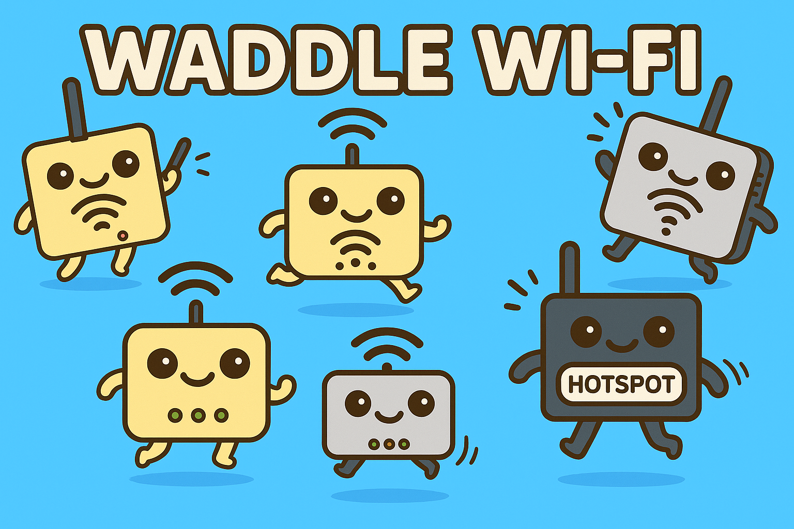

# 📡 Waddle: A Decentralized 5G Network on Flow



## Demo

**Live Demo:** [https://waddle-gules.vercel.app/](https://waddle-gules.vercel.app/)

**Contract Addresses:**

-   Testnet: [0xcc6a3536f37381a2](https://testnet.flowscan.io/account/cc6a3536f37381a2)
-   Mainnet: [0xefc9bea2fda54f34](https://www.flowscan.io/account/0xefc9bea2fda54f34)

**Video Demonstration:** [Watch the Demo Video](https://drive.google.com/drive/folders/1E4zo8F2FCT4-d2DvjQthgoMHA7yh_Qpd?usp=sharing)

## Overview

Waddle is a decentralized 5G network platform built on the Flow. It addresses the challenges of current 5G infrastructure deployment by enabling individuals to set up and operate mini 5G hotspots, creating a distributed network infrastructure while earning rewards.

## Key Features

### Smart Contracts

-   **HotspotOperatorNFT**: NFT collection required to operate hotspots with secure on-chain randomness
-   **HotspotRegistry**: Smart contract to track all registered hotspot metadata and ownership
-   **FIVEGCOIN**: Fungible token for rewards and ecosystem transactions
-   **RandomPicker**: Secure on-chain randomness implementation for NFT metadata

### Advanced Flow Blockchain Features

-   **Nested Resources**: Enhanced NFT capabilities with nested resources
-   **Secure On-chain Randomness**: Trustless NFT minting without backend requirements
-   **Cross VM Metadata Views**: Interoperable metadata standards between Cadence and EVM
-   **Account Linking**: Hybrid custody implementation to bridge Flow ecosystem
-   **Key Cycling**: Enhanced account scalabilty and management

### User Interface

-   **Dashboard & Network Map**: Monitor hotspot status, view network statistics, and track rewards
-   **Hotspot Management**: Register and manage 5G hotspots
-   **NFT Collection**: Mint and view your Hotspot Operator NFTs
-   **Account Linking**: Connect your Magic.link account with Flow Wallet for expanded capabilities

## Architecture

```
┌────────────────────┐    ┌───────────────────────┐    ┌────────────────┐
│   Dashboard Site   │    │   Flow Blockchain     │    │  Admin Backend │
│   (Frontend)       │◄───┤   (Smart Contracts)   │◄───┤  (Simulated)   │
└────────────────────┘    └───────────────────────┘    └────────────────┘
        │                           │
        │                           │
        ▼                           ▼
┌────────────────────┐    ┌───────────────────────┐
│ Magic Link & Flow  │    │ NFT Marketplaces      │
│ Wallet Integration │    │ OpenSea               │
└────────────────────┘    └───────────────────────┘
```

### Components

1. **Frontend (Next.js)**

    - User authentication via Magic.link
    - NFT minting interface
    - Hotspot registration and management
    - Rewards tracking and network visualization

2. **Smart Contracts (Cadence)**

    - NFT implementation with nested resources and onchain randomness
    - Hotspot registry and management
    - Token economics and reward distribution
    - Account linking capabilities

3. **Backend (Simulated)**
    - Uptime validation
    - Location assigning
    - Reward distribution
    - Admin functions

## AI-Assisted Development

This project leveraged AI-assisted development techniques to accelerate implementation and problem-solving:

### Development Workflow

1. **Planning Phase**

    - Requirements gathering and feature prioritization with AI assistance
    - Architecture design validation through structured prompting
    - Component breakdown and dependency analysis

2. **Implementation Assistance**

    - Smart contract code generation and auditing
    - Frontend component scaffolding
    - Complex flow integration problem-solving
    - Debug assistance for blockchain interaction issues

3. **Quality Improvement**
    - Code review and optimization suggestions
    - UI/UX enhancement recommendations
    - Documentation generation and improvement

AI tools were particularly valuable for rapidly prototyping frontend.

## Getting Started

### Prerequisites

-   Node.js v16 or later
-   Flow CLI (for contract interaction)
-   Flow account (for deployment)

### Local Development

1. **Clone the repository**

    ```bash
    git clone https://github.com/bz-hashtag-0780/waddle.git
    cd waddle
    ```

2. **Frontend setup**

    ```bash
    cd frontend
    npm install
    npm run dev
    ```

    Open [http://localhost:3000](http://localhost:3000) in your browser

## NFT Showcase

The Waddle project features unique Hotspot Operator NFTs with distinctive designs. Owning one of these NFTs is required to register and operate a hotspot on the network.

<div align="center">
  
  
  
</div>

These NFTs implement Flow's advanced resource model with nested resources and utilize secure onchain randomness for trait generation during the minting process.

## Technical Deep Dives

### NFTs with Nested Resources & Onchain Randomness

Our NFT implementation uses Flow's advanced resource model to infuse tokens into the NFT. The onchain randomness implementation ensures a trustless NFT minting process without requiring a centralized backend.

### Cross VM Metadata Views

We implement standardized metadata interfaces that allow NFT data to be consumed across different virtual machines and blockchain ecosystems to enhance interoperability.

### Account Linking

Our hybrid custody implementation bridges the Flow ecosystem, allowing Magic.link custodial wallets to interact with Flow Wallet accounts, providing enhanced security and flexibility.

### Key Rotation Cycling

We implement key rotation cycling for our admin account in our backend to scale transactions.

## Future Roadmap

1. **Token Rewards with Access Account Functions**: Implement automated reward distribution based on hotspot performance
2. **OpenSea NFT Trading**: Enable trading of Hotspot Operator NFTs on OpenSea via blockchain bridges
3. **WiFi Onboarding Page**: Create seamless onboarding experience when connecting to Waddle hotspots
4. **USDF Liquidity Pool**: Establish liquidity pool with 5G Coin on KittyPunch

## Known Limitations & Considerations

-   **Simulation Only**: This hackathon project simulates 5G hardware integration
-   **Admin Key Security**: Production deployment would require more robust key management
-   **Hotspot Registry Transfers**: NFT transfers require careful handling to maintain reward distribution accuracy

## Hackathon Journey

This project was built during an intense 3-day hackathon with the following development timeline:

1. **Day 1**

    - NFTs with nested resources and onchain randomness implementation
    - Cross VM Metadata Views integration
    - Mint NFTs on frontend and display collection
    - Initial account linking implementation

2. **Day 2**

    - Completed account linking
    - Hotspot registration and frontend display

3. **Day 3 (Final Day)**

    - Admin backend development for location assignment and uptime simulation
    - Mainnet smart contract deployment
    - Frontend deployment to Vercel
    - Backend deployment to Heroku
    - Documentation and video creation

Throughout the hackathon, we prioritized features based on technical complexity and user value, focusing on delivering a functional end-to-end experience with the core network functionality.

## Team

Built by bz @ Flow Foundation

## License

[MIT License](LICENSE)
